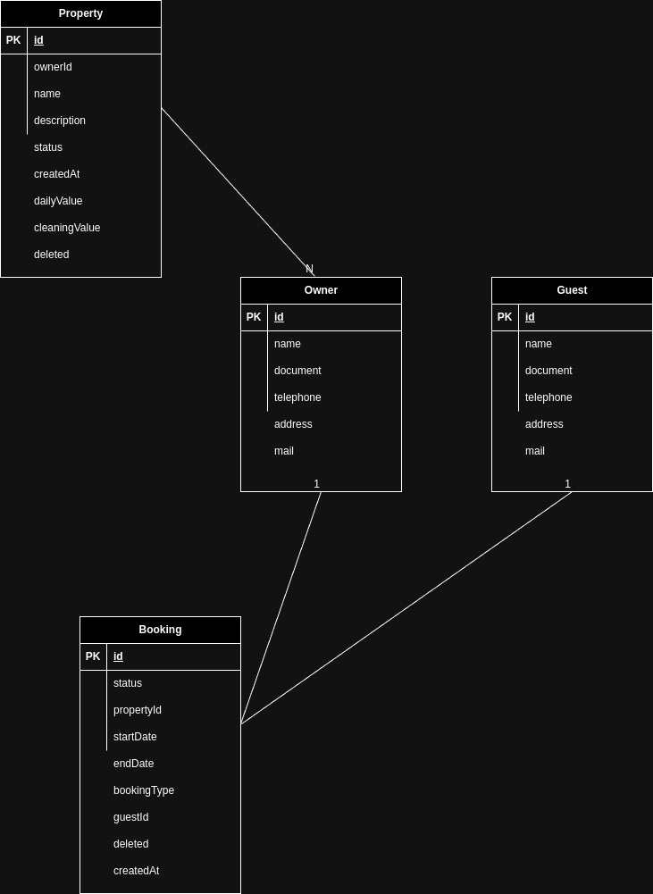

# booking-service API


## How to Run the Project

Follow these steps to run the project:

1. Navigate to the project directory:
    ```bash
    cd booking-service
    ```

2. Clean and install the Maven dependencies:
    ```bash
    mvn clean install
    ```

3. Build the Docker containers:
    ```bash
    docker-compose build
    ```

4. Start the Docker containers:
    ```bash
    docker-compose up
    ```

The project should now be running and accessible. You can access it at [http://localhost:8080](http://localhost:8080).

## Swagger UI

You can access the Swagger UI to explore the API endpoints by navigating to [http://localhost:8080/swagger-ui/index.html#](http://localhost:8080/swagger-ui/index.html#).

## API Postman Collection

You can also access the postman collection on /resources/booking_api_collection.json


## H2 DATABASE

You can access the H2 database console by navigating to [http://localhost:8080/h2-console#](http://localhost:8080/h2-console).


## Database Architecture

This image illustrates the architecture of the database utilized by the booking-service API.
